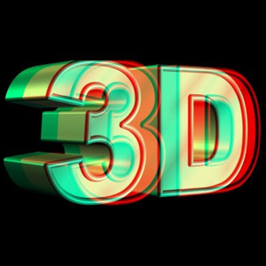
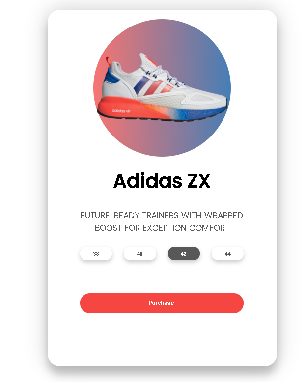
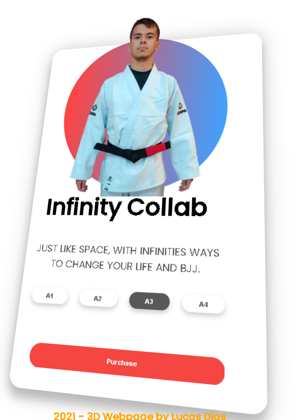

<h1 align="center">
    
</h1>

# Summary

- [Description](#📝-Description)
- [Project](#💻-Project)
- [Technologies](#🚀-Technologies)
- [Project Stats](#🎯-Project-Stats)

---

## 📝 Description

>💻 3D Product Effect is a preview of a product, the main idea is to create an uncommon loadout to a buying product, the project was created by Dev ED in order to practice HTML, CSS and JavaScript.

---

## 💻 Project

* <b>Product</b>: You can move the product and view the 3D effect by moving the mouse over the product card.

* <b>Setup</b>: In order to change the original project made from Dev ED, i've add a second project based on a Brazilian Jiu-Jitsu GI, the projects are in different folders.

<h1 align="center">
    
</h1>

<h1 align="center">
    
</h1>

---

## 🚀 Technologies
This project was developed with the following technologies:
* VS Code;
* HTML;
* CSS;
* JavaScript.

---

## 🎯 Project Stats

This project is currently finished.

---

## :heavy_check_mark: To do list

- More Products at the same page
- Zoom out default to 67%
- Activate Purchase button
- Add Cart
- Add Header
- Add Product enhanced Description

---

## :handshake: Become a Contributor

Do you have any ideas that you want to implement it? It's simple!

1. Fork the project
2. Modify what you think is necessary
3. Commit the changes
4. Create a Pull Request

---

## Author

- Projects - [Lucass2021](https://github.com/Lucass2021)

- Linkedin - [@Lucas Dias da Silva](https://www.linkedin.com/in/lucas-dias-da-silva-118954199/)

- Email - [Lucas Dias](mailto:lucas.allx@hotmail.com")
